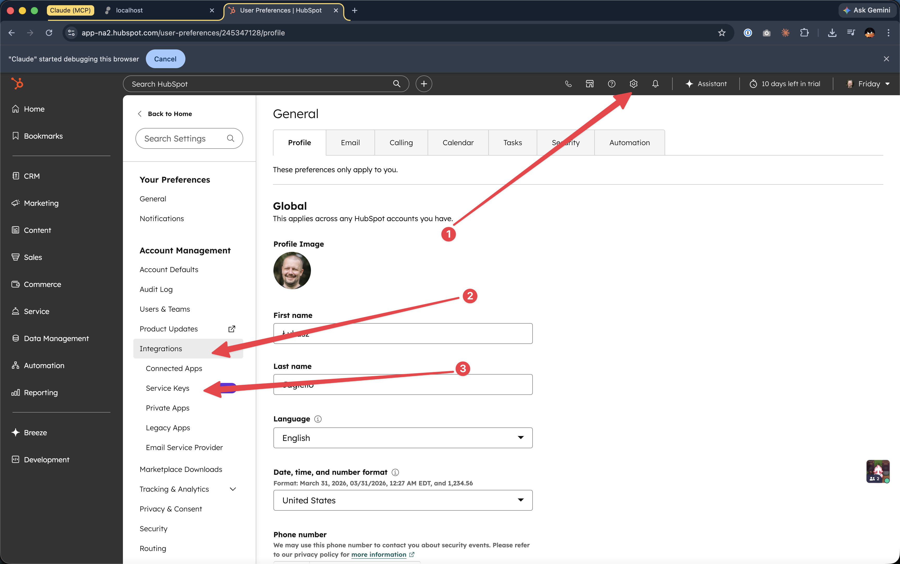
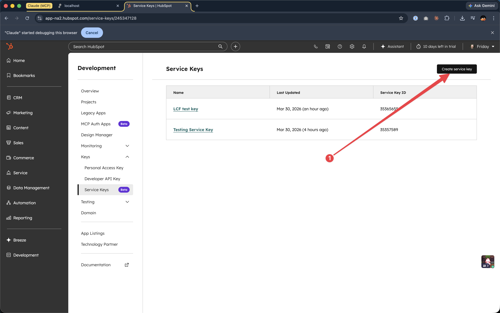
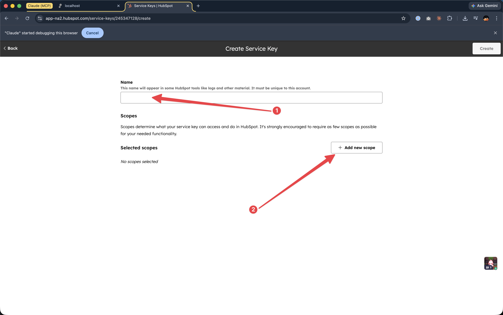
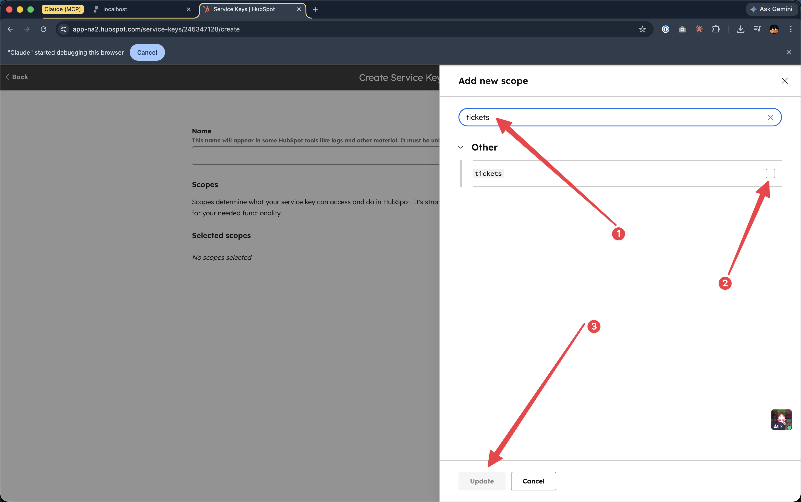
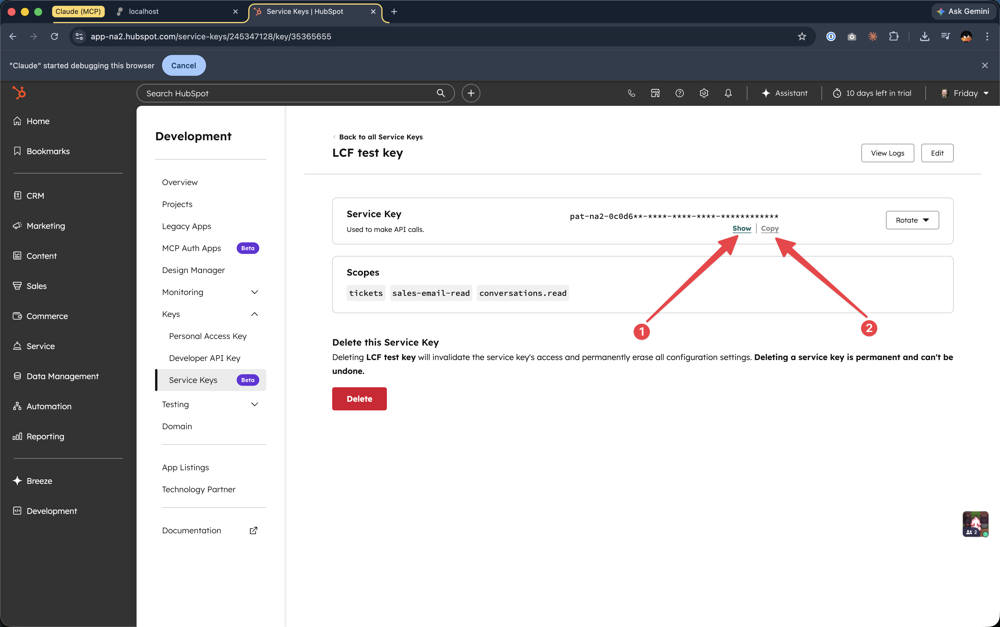

# HubSpot Ticket & Conversation Dump

Exports all tickets and their full conversation histories (emails, replies, threads) from HubSpot into CSV files.

## What This Does

This tool connects to your HubSpot account and downloads:

1. **All tickets** with their metadata (status, priority, category, dates, owner, etc.)
2. **All emails** associated with each ticket (incoming and outgoing)
3. **All conversation threads** linked to each ticket (chat messages, thread replies)

Everything is saved as CSV files that you can open in Excel, import into a database, or feed into a knowledge base.

## Prerequisites

- [Docker Desktop](https://www.docker.com/products/docker-desktop/) installed and running
- A **HubSpot Service Key** (see next section)

## Getting a HubSpot Service Key

A service key allows this tool to read data from your HubSpot account. Follow these steps to create one:

### Step-by-step instructions

**1.** Log in to your HubSpot account and click the **Settings gear icon** in the top navigation bar. In the left sidebar, expand **Integrations** and click **Service Keys**:



**2.** On the Service Keys page, click **"Create service key"** in the top right corner:



**3.** Enter a **Name** for your key (e.g. "Ticket Dump"):



**4.** Click **"+ Add new scope"**. In the search box, search for each of the three required scopes one at a time and check the box for each:

| Scope | Why it's needed |
|-------|----------------|
| `tickets` | Read ticket data and associations |
| `conversations.read` | Read conversation threads and messages |
| `sales-email-read` | Read email content associated with tickets |



**5.** Click **"Update"** after selecting all three scopes, then click **"Create"**. Your key will be shown on the next page. Click **"Show"** to reveal it, then **"Copy"** to copy it to your clipboard:



The token looks like: `pat-na2-xxxxxxxx-xxxx-xxxx-xxxx-xxxxxxxxxxxx`

## How to Run

### Step 1: Set up your token

Create a file called `.env` with your service key and portal ID:

```
HUBSPOT_ACCESS_TOKEN=pat-na2-your-actual-token-here
HUBSPOT_PORTAL_ID=12345678
```

You can find your portal ID in any HubSpot URL: `app.hubspot.com/contacts/{portal_id}/...`

### Step 2: Run the export

```bash
docker run --env-file .env -v "$(pwd)/output:/app/output" tempestdx/hubspot-export
```

That's it! The tool will:
- Read your HubSpot token from the `.env` file
- Download all tickets and their conversations
- Save the output files in the `output/` folder on your machine

You'll see progress in the terminal:

```
=== HubSpot Ticket + Conversation Dump ===

Fetching all tickets...
Fetched 4 tickets.

Fetching emails and conversation messages for each ticket...
Progress: 4/4 tickets (100.0%) | 3 emails, 5 conversation msgs

=== Dump Complete ===
Tickets:      4
Messages:     8
  Emails:     3
  Conversations: 5
```

## Output Files

After the export completes, you'll find three files in the `output/` folder:

### `tickets.csv`

One row per ticket. Contains ticket metadata.

| Column | Description | Example |
|--------|-------------|---------|
| `ticket_id` | HubSpot ticket ID | `12345678` |
| `ticket_name` | Ticket subject/title | `Cannot login to dashboard` |
| `ticket_status` | Current pipeline stage | `1` |
| `ticket_category` | Ticket category | `PRODUCT_ISSUE` |
| `pipeline` | Pipeline name/ID | `0` |
| `pipeline_stage` | Stage within pipeline | `1` |
| `priority` | Priority level | `HIGH` |
| `owner_id` | HubSpot owner ID | `987654` |
| `contact_emails` | Associated contact emails | `john@example.com` |
| `company_name` | Primary company name | `Acme Corp` |
| `create_date` | When the ticket was created | `2024-01-15T10:30:00Z` |
| `close_date` | When the ticket was closed | `2024-01-16T14:00:00Z` |
| `last_modified` | Last modification date | `2024-01-16T14:00:00Z` |
| `source_type` | How the ticket was created | `EMAIL` |
| `message_count` | Total messages found | `5` |
| `url` | Direct link to ticket in HubSpot | `https://app.hubspot.com/...` |

### `messages.csv`

One row per message. Contains the full conversation history for all tickets.

| Column | Description | Example |
|--------|-------------|---------|
| `ticket_id` | Which ticket this belongs to | `12345678` |
| `message_id` | Unique message ID | `msg_abc123` |
| `timestamp` | When the message was sent | `2024-01-15T10:30:00Z` |
| `direction` | `INCOMING` (customer) or `OUTGOING` (agent) | `INCOMING` |
| `sender` | Sender's email address | `john@example.com` |
| `recipient` | Recipient's email address | `support@company.com` |
| `subject` | Email subject line | `Re: Cannot login` |
| `body` | Message content (plain text) | `I tried resetting my password but...` |
| `source_type` | `EMAIL` or `CONVERSATION` | `EMAIL` |
| `thread_id` | Conversation thread ID (if applicable) | `thread_789` |

### `dump.jsonl`

One JSON object per line, containing the full structured data for each ticket and all its messages. Useful for programmatic processing.

## How Long Does It Take?

| Ticket Count | Estimated Time |
|-------------|---------------|
| 1-100 | Under 1 minute |
| 1,000 | 2-5 minutes |
| 10,000 | 15-25 minutes |
| 50,000 | 1-2 hours |

The tool uses batch APIs and parallel fetching to maximize throughput while respecting HubSpot's rate limits (100 requests per 10 seconds). Email associations and content are fetched in bulk (up to 1,000 per request), and conversation threads are fetched with 10 concurrent workers. Progress with ETA is printed to the terminal as it runs.

## Troubleshooting

### "HUBSPOT_ACCESS_TOKEN is not set"

Make sure you:
1. Created the `.env` file (copy from `.env.example`)
2. Added your actual token to the `.env` file
3. Included `--env-file .env` in the `docker run` command

### "HubSpot API 401" or "Unauthorized"

Your token is invalid or expired. Generate a new one in HubSpot Settings → Integrations → Private Apps.

### "HubSpot API 403" or "Forbidden"

Your token is missing required scopes. Go to your Private App settings and make sure these scopes are enabled:
- `tickets`
- `conversations.read`
- `sales-email-read`

If you see 403 errors specifically when fetching emails, you may also need to add the `crm.objects.emails.read` scope.

### "Rate limit exceeded" or "429 Too Many Requests"

The tool has built-in rate limiting, but if you see this error it will automatically retry. If it persists, the batch size can be reduced via environment variable:

```bash
docker run --env-file .env -e BATCH_SIZE=10 -v "$(pwd)/output:/app/output" tempestdx/hubspot-export
```

### The output files are empty

Check the terminal output for errors. Common causes:
- No tickets exist in the HubSpot account
- The token doesn't have the `tickets` scope
- Network connectivity issues

## Environment Variables

| Variable | Required | Default | Description |
|----------|----------|---------|-------------|
| `HUBSPOT_ACCESS_TOKEN` | Yes | — | Your HubSpot service key / PAT |
| `OUTPUT_DIR` | No | `./output` | Where to save the dump files |
| `HUBSPOT_PORTAL_ID` | No | — | HubSpot portal ID (used for ticket URLs in the CSV). Find it in your HubSpot URL: `app.hubspot.com/contacts/{portal_id}/...` |
| `CONCURRENCY` | No | `10` | Number of parallel conversation fetches. Lower if you hit rate limits |
